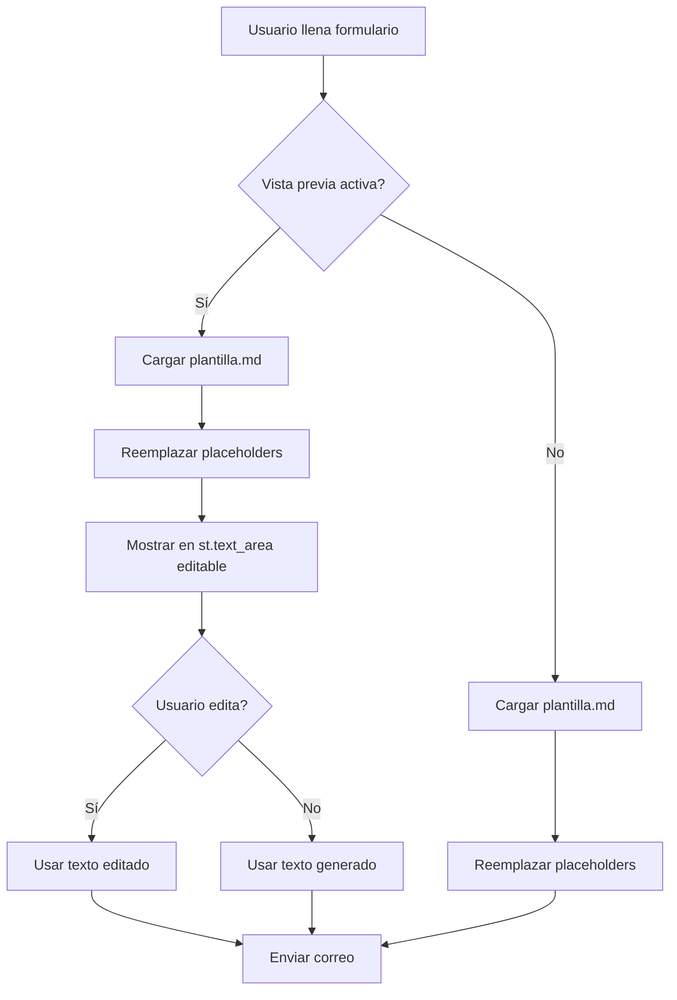

# Mail de Cierre - Guía de Implementación

## 1. Objetivo del Módulo

El módulo **"Mail de Cierre"** automatiza el envío de correos de cierre de negocios vehiculares a clientes, siguiendo el flujo:

```
Input (textarea) → Parsing → Preview/Edit → Send → Confirmation
```

**Propósito**: Simplificar la comunicación post-venta mediante plantillas pre-configuradas con datos extraídos automáticamente, manteniendo consistencia visual y profesional en todas las comunicaciones.

**Alcance**:
- Card independiente en el menú principal (3ra card)
- NO interfiere con flujos existentes (AutoTramite, Habilitación Tag)
- SMTP ya configurado en `.env` (variables: `SMTP_HOST`, `SMTP_PORT`, `SMTP_USER`, `SMTP_PASS`, `SMTP_SECURE`)
- Plantilla base: `/docs/correo-cierre/plantilla.md`
- **CCO (BCC)** configurable para copias ocultas automáticas
- **Historial de envíos** en formato liviano (JSON) para auditoría
- **Sistema de configuración** centralizado via `mail_config.yaml`

---

## 1.1 Actualización del Documento (Versión 2.0)

Este documento ha sido **actualizado y expandido** con análisis de sistemas de configuración y nuevas funcionalidades:

### 🆕 Funcionalidades Añadidas

| Funcionalidad | Descripción | Sección |
|---------------|-------------|---------|
| **📋 CCO (BCC) Automático** | Copias ocultas configurables a gerencia/admin | 6.4 |
| **📚 Historial de Envíos** | Log JSON liviano con ofuscación de emails | 6.7 |
| **⚙️ Sistema YAML** | Configuración centralizada en `mail_config.yaml` | 6.6 |
| **🔍 Análisis config-mail.js** | Evaluación técnica: ¿YAML, JSON o JS? | 6.5 |
| **👁️ Vista de Historial UI** | Interfaz para consultar últimos envíos | 6.7.3 |

### 🎯 Decisiones Técnicas Clave

1. **YAML vs JSON vs JS**: Se eligió YAML por ser nativo Python, estructurado y seguro (sección 6.5)
2. **Historial en JSON**: Formato liviano y legible, rotación automática, privacidad mediante ofuscación
3. **BCC en config**: Separado de `.env` para facilitar edición sin riesgo de exponer credenciales

### 📖 Nuevas Secciones

- **6.4** - CCO (BCC) Automático: Implementación completa con ejemplos
- **6.5** - Análisis de Sistemas de Configuración: Comparativa técnica
- **6.6** - Sistema de Configuración con YAML: Estructura completa y funciones
- **6.7** - Historial de Envíos: Guardado, ofuscación y rotación
- **10.1** - Funcionalidades Implementadas: Resumen de lo incluido en MVP
- **12** - FAQs Expandido: 9 preguntas nuevas sobre BCC, YAML e historial

---

## 1.2 Flujo Completo con Nuevas Funcionalidades

```
Usuario                App                 mail_config.yaml      SMTP Server         Historial
   │                    │                         │                   │                  │
   │ 1. Input datos     │                         │                   │                  │
   ├──────────────────>│                         │                   │                  │
   │                    │ 2. Cargar config        │                   │                  │
   │                    ├────────────────────────>│                   │                  │
   │                    │ 3. BCCs + firma         │                   │                  │
   │                    │<────────────────────────┤                   │                  │
   │                    │ 4. Parse nombre         │                   │                  │
   │                    │ 5. Generar plantilla    │                   │                  │
   │ 6. Preview         │                         │                   │                  │
   │<──────────────────┤                         │                   │                  │
   │ 7. Confirmar envío │                         │                   │                  │
   ├──────────────────>│                         │                   │                  │
   │                    │ 8. Validar cooldown     │                   │                  │
   │                    │ 9. Enviar email + BCCs  │                   │                  │
   │                    ├───────────────────────────────────────────>│                  │
   │                    │                         │  10. OK           │                  │
   │                    │<───────────────────────────────────────────┤                  │
   │                    │ 11. Guardar historial   │                   │                  │
   │                    ├──────────────────────────────────────────────────────────────>│
   │                    │                         │                   │  12. JSON creado │
   │                    │<──────────────────────────────────────────────────────────────┤
   │ 13. Confirmación   │                         │                   │                  │
   │<──────────────────┤                         │                   │                  │
   │ 14. Ver historial  │                         │                   │                  │
   ├──────────────────>│                         │                   │                  │
   │                    │ 15. Listar /enviados    │                   │                  │
   │                    ├──────────────────────────────────────────────────────────────>│
   │ 16. Últimos envíos │                         │                   │                  │
   │<──────────────────┤                         │                   │                  │
```

**Componentes del Flujo**:
1. **Input**: Usuario ingresa datos del cliente y vehículo
2. **Config**: App carga `mail_config.yaml` para BCCs, firma, cooldown
3. **Parsing**: Extrae nombre del cliente desde DATOS_PROPIETARIO
4. **Plantilla**: Reemplaza placeholders y genera email
5. **Preview**: Muestra email editable (si checkbox activo)
6. **Validación**: Cooldown, email format, campos requeridos
7. **SMTP**: Envía a destinatario + BCCs configurados
8. **Historial**: Guarda JSON con datos ofuscados en `/enviados`
9. **Confirmación**: Muestra resultado + link a historial

---

## 2. UX/UI Propuesto (Alineado a Cards Existentes)

### 2.1 Estructura Visual

**Menú Principal** (modificación mínima en `app.py:452-483`):

```html
<!-- Card 3: Mail de Cierre -->
<div class="menu-card">
    <h3>Mail de Cierre</h3>
    <p>Envío automatizado de correos de cierre de negocio.</p>
    <span class="menu-tag">Activo</span>
</div>
```

**Layout de la Card** (consistente con AutoTramite y Tag):

```
┌─────────────────────────────────────────────────┐
│ ← Volver al menú                                │
├─────────────────────────────────────────────────┤
│ 📧 Mail de Cierre - Envío de Confirmación      │
├─────────────────────────────────────────────────┤
│ 1. Ingresar Datos del Cliente                  │
│   ┌─────────────────────────────────────────┐  │
│   │ DATOS DEL PROPIETARIO (textarea)        │  │
│   │ Nombre : ORIANA ISOLINA ARAYA AVENDAÑO  │  │
│   │ R.U.N. : 10.982.440-2                   │  │
│   │ Fec. adquisición: 20-09-2018            │  │
│   │ Repertorio : RVM CATEDRAL               │  │
│   └─────────────────────────────────────────┘  │
│                                                 │
│   Vehículo: [JEEP GRAND CHEROKEE LTD 4X4...]  │
│   Precio Acordado: [LIQUIDO A RECIBIR $17...] │
│   Fecha de Pago: [10-02-2026 AL 13-02-2026]   │
│   Email Destino: [cliente@ejemplo.cl]         │
│   ☐ Vista previa antes de enviar              │
│                                                 │
│   [🚀 Generar Correo]                          │
├─────────────────────────────────────────────────┤
│ 2. Vista Previa y Edición (condicional)       │
│   ┌─────────────────────────────────────────┐  │
│   │ Asunto: Cierre de negocio - Vehículo... │  │
│   │                                          │  │
│   │ Buenas tardes estimados ORIANA...       │  │
│   │ (texto editable)                         │  │
│   └─────────────────────────────────────────┘  │
│                                                 │
│   [← Editar Datos] [📤 Enviar Correo]         │
├─────────────────────────────────────────────────┤
│ 3. Resultado                                   │
│   ✅ Correo enviado exitosamente               │
│   📧 Enviado a: cliente@ejemplo.cl             │
│   🕐 Fecha: 2026-02-05 14:30:15                │
│                                                 │
│   [🔄 Enviar Otro Correo]                      │
└─────────────────────────────────────────────────┘
```

### 2.2 Tema Visual

**Reutilizar paleta existente** (app.py:270-450):
- Modo claro: `--menu-card`, `--menu-btn`, `--menu-shadow`
- Modo oscuro: soporte automático via CSS variables
- Iconografía: 📧 (email), 📤 (send), ✅ (success), ❌ (error)

### 2.3 Estados de la Card

| Estado | Trigger | UI Visible |
|--------|---------|------------|
| **Input** | Initial load | Formulario de datos + botón "Generar Correo" |
| **Preview** | Click "Generar" + checkbox activo | Textarea editable + botones "Editar Datos" / "Enviar" |
| **Sending** | Click "Enviar" | Spinner + mensaje "Enviando correo..." |
| **Success** | SMTP success | Confirmación verde + metadatos + botón "Enviar Otro" |
| **Error** | SMTP/parsing failure | Mensaje de error rojo + botón "Reintentar" |

---

## 3. Campos del Formulario + Validaciones

### 3.1 Campos de Entrada

| Campo | Tipo | Placeholder/Ejemplo | Validación | Requerido |
|-------|------|---------------------|------------|-----------|
| `datos_propietario` | `st.text_area` | Ver ejemplo abajo | Parsing exitoso de `Nombre :` | ✅ Sí |
| `vehiculo` | `st.text_input` | "JEEP GRAND CHEROKEE LTD 4X4 3.6 AUT 2019 KVSX.14-3" | Longitud > 5 caracteres | ✅ Sí |
| `precio_acordado` | `st.text_input` | "LIQUIDO A RECIBIR $17.000.000" | Longitud > 5 caracteres | ✅ Sí |
| `fecha_pago` | `st.text_input` | "10-02-2026 AL 13-02-2026" | Longitud > 5 caracteres | ✅ Sí |
| `email_destino` | `st.text_input` | "cliente@ejemplo.cl" | `validar_email()` (src/validators.py:160) | ✅ Sí |
| `vista_previa` | `st.checkbox` | "Vista previa antes de enviar" | N/A | ❌ No (default: False) |

**Ejemplo de `datos_propietario`** (multilínea):
```
DATOS DEL PROPIETARIO
Nombre : ORIANA ISOLINA ARAYA AVENDAÑO
R.U.N. : 10.982.440-2
Fec. adquisición: 20-09-2018
Repertorio : RVM CATEDRAL
```

### 3.2 Validaciones (Pre-Envío)

**Validación 1: Datos Propietario**
- Regex: `r'^\s*Nombre\s*:\s*(.+)$'` (multiline, case-insensitive)
- Si no se encuentra: `st.error('❌ Campo "Nombre :" no encontrado en DATOS DEL PROPIETARIO')`

**Validación 2: Email Destino**
- Reutilizar: `from src.validators import validar_email`
- Si inválido: `st.error('❌ Email destino inválido')`

**Validación 3: Campos Obligatorios**
- Todos los campos excepto `vista_previa` deben tener `.strip() != ""`
- Si vacío: `st.error('❌ Todos los campos son obligatorios')`

**Validación 4: SMTP Configurado**
- Verificar: `os.getenv('SMTP_HOST')` and `os.getenv('SMTP_USER')`
- Si falta: `st.error('❌ SMTP no configurado en .env')`

### 3.3 Ejemplo de Validación en Código

```python
def validar_datos_mail(datos_prop: str, email: str, vehiculo: str, precio: str, fecha: str) -> tuple[bool, list[str]]:
    """
    Valida datos del formulario de mail de cierre.

    Returns:
        tuple: (es_valido, lista_de_errores)
    """
    errores = []

    # 1. Email destino
    if not validar_email(email):
        errores.append('Email destino inválido')

    # 2. Parsing de nombre
    nombre_cliente = extraer_nombre_cliente(datos_prop)
    if not nombre_cliente:
        errores.append('Campo "Nombre :" no encontrado en DATOS DEL PROPIETARIO')

    # 3. Campos obligatorios
    if not datos_prop.strip():
        errores.append('DATOS DEL PROPIETARIO es obligatorio')
    if not vehiculo.strip():
        errores.append('Vehículo es obligatorio')
    if not precio.strip():
        errores.append('Precio acordado es obligatorio')
    if not fecha.strip():
        errores.append('Fecha de pago es obligatoria')

    # 4. SMTP config
    if not (os.getenv('SMTP_HOST') and os.getenv('SMTP_USER')):
        errores.append('SMTP no configurado en .env (falta SMTP_HOST o SMTP_USER)')

    return (len(errores) == 0, errores)
```

---

## 4. Parsing Robusto de {DATOS_PROPIETARIO} → {NOMBRE_CLIENTE}

### 4.1 Estrategia de Extracción

**Patrón Principal** (basado en `src/models.py:111-124`):

```python
def extraer_nombre_cliente(texto: str) -> str | None:
    """
    Extrae nombre del cliente desde bloque DATOS DEL PROPIETARIO.

    Regla:
    - Buscar línea que contenga "Nombre :" (case-insensitive)
    - Capturar todo lo que sigue después de ":"
    - Normalizar: strip() + upper()

    Args:
        texto: Bloque de texto multilínea

    Returns:
        str | None: Nombre en MAYÚSCULAS o None si no se encuentra

    Examples:
        >>> texto = '''
        ... DATOS DEL PROPIETARIO
        ... Nombre : ORIANA ISOLINA ARAYA AVENDAÑO
        ... R.U.N. : 10.982.440-2
        ... '''
        >>> extraer_nombre_cliente(texto)
        'ORIANA ISOLINA ARAYA AVENDAÑO'
    """
    import re

    # Regex: busca "Nombre :" seguido de cualquier texto hasta fin de línea
    match = re.search(
        r'^\s*Nombre\s*:\s*(.+)$',
        texto,
        flags=re.IGNORECASE | re.MULTILINE
    )

    if match:
        nombre = match.group(1).strip().upper()
        return nombre if nombre else None

    return None
```

### 4.2 Edge Cases y Manejo de Errores

| Caso | Input | Output | Acción |
|------|-------|--------|--------|
| **Normal** | `Nombre : ORIANA ARAYA` | `"ORIANA ARAYA"` | ✅ Parseo exitoso |
| **Espacios extra** | `Nombre  :   ORIANA   ` | `"ORIANA"` | ✅ Normalizado con `.strip()` |
| **Minúsculas** | `nombre: oriana araya` | `"ORIANA ARAYA"` | ✅ Convertido a mayúsculas |
| **Sin campo** | `RUT: 12345678-9` | `None` | ❌ Mostrar error |
| **Campo vacío** | `Nombre : \n` | `None` | ❌ Mostrar error |
| **Múltiples ocurrencias** | Dos líneas con `Nombre :` | Primera ocurrencia | ⚠️ Tomar primer match |
| **Caracteres especiales** | `Nombre : MARÍA JOSÉ` | `"MARÍA JOSÉ"` | ✅ Preservar tildes/Ñ |
| **Nombre compuesto** | `Nombre : MARÍA DEL CARMEN` | `"MARÍA DEL CARMEN"` | ✅ Capturar todo |

**Manejo de Error en UI**:
```python
nombre_cliente = extraer_nombre_cliente(datos_propietario)

if nombre_cliente is None:
    st.error(
        '❌ No se encontró el campo "Nombre :" en DATOS DEL PROPIETARIO. '
        'Verifica el formato:\n\n'
        'Nombre : ORIANA ISOLINA ARAYA AVENDAÑO'
    )
    st.stop()
```

### 4.3 Tests Unitarios Recomendados

```python
# tests/test_mail_parsing.py
import pytest
from src.mail_utils import extraer_nombre_cliente

def test_extraer_nombre_normal():
    texto = "Nombre : ORIANA ARAYA"
    assert extraer_nombre_cliente(texto) == "ORIANA ARAYA"

def test_extraer_nombre_espacios():
    texto = "Nombre  :   ORIANA   "
    assert extraer_nombre_cliente(texto) == "ORIANA"

def test_extraer_nombre_minusculas():
    texto = "nombre: oriana araya"
    assert extraer_nombre_cliente(texto) == "ORIANA ARAYA"

def test_extraer_nombre_no_encontrado():
    texto = "RUT: 12345678-9"
    assert extraer_nombre_cliente(texto) is None

def test_extraer_nombre_vacio():
    texto = "Nombre : \n"
    assert extraer_nombre_cliente(texto) is None

def test_extraer_nombre_caracteres_especiales():
    texto = "Nombre : MARÍA JOSÉ NÚÑEZ"
    assert extraer_nombre_cliente(texto) == "MARÍA JOSÉ NÚÑEZ"
```

---

## 5. Estrategia de Plantilla Editable

### 5.1 Flujo de Plantilla



### 5.2 Motor de Reemplazo de Placeholders

**Placeholders Definidos** (plantilla.md):

| Placeholder | Fuente | Ejemplo |
|-------------|--------|---------|
| `{NOMBRE_CLIENTE}` | Parsing de `datos_propietario` | "ORIANA ISOLINA ARAYA AVENDAÑO" |
| `{VEHICULO}` | Campo `vehiculo` | "JEEP GRAND CHEROKEE LTD 4X4 3.6 AUT 2019 KVSX.14-3" |
| `{PRECIO_ACORDADO_CLIENTE}` | Campo `precio_acordado` | "LIQUIDO A RECIBIR $17.000.000" |
| `{FECHA_PAGO}` | Campo `fecha_pago` | "10-02-2026 AL 13-02-2026" |
| `{DATOS_PROPIETARIO_COMPLETOS}` | Campo `datos_propietario` completo | Todo el bloque multilínea |

**Función de Reemplazo**:

```python
def generar_email_desde_plantilla(
    datos_propietario: str,
    vehiculo: str,
    precio_acordado: str,
    fecha_pago: str,
    plantilla_path: Path = Path('docs/correo-cierre/plantilla.md')
) -> tuple[str, str]:
    """
    Genera email desde plantilla con reemplazo de placeholders.

    Args:
        datos_propietario: Bloque DATOS DEL PROPIETARIO
        vehiculo: Descripción del vehículo
        precio_acordado: Precio acordado con cliente
        fecha_pago: Rango de fechas de pago
        plantilla_path: Ruta a plantilla.md

    Returns:
        tuple[str, str]: (asunto, cuerpo_email)

    Raises:
        FileNotFoundError: Si no existe plantilla.md
        ValueError: Si no se puede extraer nombre del cliente
    """
    if not plantilla_path.exists():
        raise FileNotFoundError(f'Plantilla no encontrada: {plantilla_path}')

    # 1. Cargar plantilla
    plantilla = plantilla_path.read_text(encoding='utf-8')

    # 2. Extraer nombre del cliente
    nombre_cliente = extraer_nombre_cliente(datos_propietario)
    if not nombre_cliente:
        raise ValueError('No se pudo extraer nombre del cliente')

    # 3. Reemplazar placeholders
    email_body = plantilla
    email_body = email_body.replace('{NOMBRE_CLIENTE}', nombre_cliente)
    email_body = email_body.replace('{VEHICULO}', vehiculo)
    email_body = email_body.replace('{PRECIO_ACORDADO_CLIENTE}', precio_acordado)
    email_body = email_body.replace('{FECHA_PAGO}', fecha_pago)
    email_body = email_body.replace('{DATOS_PROPIETARIO_COMPLETOS}', datos_propietario)

    # 4. Generar asunto (primeras palabras del vehículo)
    vehiculo_corto = ' '.join(vehiculo.split()[:4])  # "JEEP GRAND CHEROKEE LTD"
    asunto = f'Cierre de negocio - {vehiculo_corto}'

    return asunto, email_body
```

### 5.3 Vista Previa y Edición

**Implementación en Streamlit**:

```python
# Si checkbox "Vista previa" está activo
if vista_previa:
    asunto, email_body = generar_email_desde_plantilla(
        datos_propietario, vehiculo, precio_acordado, fecha_pago
    )

    st.subheader('2. Vista Previa y Edición')

    asunto_editado = st.text_input('Asunto', value=asunto)

    email_editado = st.text_area(
        'Cuerpo del correo (editable)',
        value=email_body,
        height=400,
        help='Puedes modificar el texto antes de enviar'
    )

    col1, col2 = st.columns(2)
    with col1:
        if st.button('← Editar Datos', use_container_width=True):
            # Volver a formulario sin enviar
            st.session_state.mail_estado = 'input'
            st.rerun()

    with col2:
        if st.button('📤 Enviar Correo', use_container_width=True, type='primary'):
            # Enviar con texto editado
            enviar_email_smtp(email_destino, asunto_editado, email_editado)
            st.session_state.mail_estado = 'success'
            st.rerun()

else:
    # Envío directo sin vista previa
    asunto, email_body = generar_email_desde_plantilla(
        datos_propietario, vehiculo, precio_acordado, fecha_pago
    )
    enviar_email_smtp(email_destino, asunto, email_body)
```

### 5.4 Ejemplo de Plantilla Final Renderizada

**Input**:
- `datos_propietario`: "Nombre : ORIANA ARAYA\nR.U.N. : 10.982.440-2"
- `vehiculo`: "JEEP GRAND CHEROKEE LTD 4X4 3.6"
- `precio_acordado`: "LIQUIDO A RECIBIR $17.000.000"
- `fecha_pago`: "10-02-2026 AL 13-02-2026"

**Output** (asunto):
```
Cierre de negocio - JEEP GRAND CHEROKEE
```

**Output** (cuerpo):
```
Buenas tardes estimados ORIANA ARAYA, la presente es para informarle que ya tenemos cierre de su vehículo JEEP GRAND CHEROKEE LTD 4X4 3.6, según lo conversado con don mario queirolo, agradecemos la confianza depositada, ante cualquier información que requiera no dude en llamarnos.

LIQUIDO A RECIBIR $17.000.000

Nombre : ORIANA ARAYA
R.U.N. : 10.982.440-2

EN LOS PROXIMOS DIAS ESTAREMOS FINIQUITADO NEGOCIO, FECHA DE PAGO ENTRE 10-02-2026 AL 13-02-2026

IMPORTANTE
1. UNA VEZ CONFIRMADO FONDOS EN CUENTA, PROCEDEMOS A FIRMAR CONTRATOS...
[... resto de la plantilla ...]
```

---

## 6. Integración con SMTP

### 6.1 Configuración SMTP

**Variables de Entorno** (ya configuradas en `.env`):

```ini
# SMTP Configuration (para Mail de Cierre)
SMTP_HOST=smtp.gmail.com
SMTP_PORT=587
SMTP_USER=dparra@queirolo.cl
SMTP_PASS=<password_encriptado>
SMTP_SECURE=tls  # tls | ssl | none
```

**Validación al Inicio**:

```python
def validar_smtp_config() -> tuple[bool, str]:
    """
    Valida que SMTP esté configurado.

    Returns:
        tuple[bool, str]: (es_valido, mensaje_error)
    """
    required = ['SMTP_HOST', 'SMTP_PORT', 'SMTP_USER', 'SMTP_PASS']
    missing = [k for k in required if not os.getenv(k)]

    if missing:
        return False, f'SMTP no configurado: faltan {", ".join(missing)}'

    return True, ''

# En la card de Mail de Cierre
smtp_ok, smtp_error = validar_smtp_config()
if not smtp_ok:
    st.error(f'❌ {smtp_error}')
    st.info('Configura las variables SMTP_* en el archivo .env')
    st.stop()
```

### 6.2 Función de Envío

```python
import smtplib
from email.mime.text import MIMEText
from email.mime.multipart import MIMEMultipart
from typing import Optional

def enviar_email_smtp(
    destinatario: str,
    asunto: str,
    cuerpo: str,
    remitente: Optional[str] = None
) -> tuple[bool, str]:
    """
    Envía email via SMTP usando config de .env.

    Args:
        destinatario: Email del destinatario
        asunto: Asunto del correo
        cuerpo: Cuerpo del correo (puede ser HTML o texto plano)
        remitente: Email del remitente (default: SMTP_USER)

    Returns:
        tuple[bool, str]: (exito, mensaje_error_o_confirmacion)

    Example:
        >>> success, msg = enviar_email_smtp(
        ...     'cliente@ejemplo.cl',
        ...     'Cierre de negocio',
        ...     'Buenas tardes...'
        ... )
    """
    try:
        # 1. Obtener configuración
        host = os.getenv('SMTP_HOST')
        port = int(os.getenv('SMTP_PORT', '587'))
        user = os.getenv('SMTP_USER')
        password = os.getenv('SMTP_PASS')
        secure = os.getenv('SMTP_SECURE', 'tls').lower()

        if not all([host, user, password]):
            return False, 'SMTP no configurado correctamente'

        remitente = remitente or user

        # 2. Crear mensaje
        msg = MIMEMultipart()
        msg['From'] = remitente
        msg['To'] = destinatario
        msg['Subject'] = asunto

        # Detectar si es HTML o texto plano
        if '<html>' in cuerpo.lower() or '<br>' in cuerpo.lower():
            msg.attach(MIMEText(cuerpo, 'html'))
        else:
            msg.attach(MIMEText(cuerpo, 'plain'))

        # 3. Conectar y enviar
        if secure == 'ssl':
            server = smtplib.SMTP_SSL(host, port)
        else:
            server = smtplib.SMTP(host, port)
            if secure == 'tls':
                server.starttls()

        server.login(user, password)
        server.send_message(msg)
        server.quit()

        return True, f'Email enviado exitosamente a {destinatario}'

    except smtplib.SMTPAuthenticationError:
        return False, 'Error de autenticación SMTP (verifica SMTP_USER y SMTP_PASS)'
    except smtplib.SMTPException as e:
        return False, f'Error SMTP: {str(e)}'
    except Exception as e:
        return False, f'Error inesperado: {str(e)}'
```

### 6.3 Manejo de Resultados

```python
# Después del envío
success, mensaje = enviar_email_smtp(email_destino, asunto, email_body)

if success:
    st.session_state.mail_resultado = {
        'exito': True,
        'email': email_destino,
        'fecha': datetime.now().strftime('%Y-%m-%d %H:%M:%S'),
        'mensaje': mensaje
    }
else:
    st.session_state.mail_resultado = {
        'exito': False,
        'error': mensaje
    }
```

### 6.4 CCO (BCC) Automático

**Objetivo**: Enviar copias ocultas automáticamente a direcciones configuradas (ej: gerencia, administración) para auditoría y seguimiento.

#### 6.4.1 Configuración de CCO

**Opción 1: Variables de Entorno** (simple, para 1-3 emails)

```ini
# .env
SMTP_BCC=admin@queirolo.cl,gerencia@queirolo.cl
```

**Opción 2: Archivo de Configuración** (recomendado, más flexible)

```yaml
# mail_config.yaml
bcc:
  enabled: true
  addresses:
    - admin@queirolo.cl
    - gerencia@queirolo.cl
    - contabilidad@queirolo.cl
  # Opcional: BCC condicional por tipo de cliente
  rules:
    - condition: "precio > 20000000"  # Ventas >20M
      addresses:
        - gerente_ventas@queirolo.cl
```

#### 6.4.2 Implementación en Función de Envío

**Actualización de `enviar_email_smtp()`**:

```python
def enviar_email_smtp(
    destinatario: str,
    asunto: str,
    cuerpo: str,
    remitente: Optional[str] = None,
    bcc: Optional[list[str]] = None  # NUEVO parámetro
) -> tuple[bool, str]:
    """
    Envía email via SMTP con soporte para CCO (BCC).

    Args:
        destinatario: Email del destinatario principal
        asunto: Asunto del correo
        cuerpo: Cuerpo del correo
        remitente: Email del remitente (default: SMTP_USER)
        bcc: Lista de emails para CCO (default: cargar desde config)

    Returns:
        tuple[bool, str]: (exito, mensaje)
    """
    try:
        # 1. Cargar BCC desde config si no se proporciona
        if bcc is None:
            bcc = cargar_bcc_config()

        # 2. Validar todos los emails (destinatario + bcc)
        if not validar_email(destinatario):
            return False, f'Email destinatario inválido: {destinatario}'

        for email in bcc:
            if not validar_email(email):
                return False, f'Email BCC inválido: {email}'

        # 3. Crear mensaje
        msg = MIMEMultipart()
        msg['From'] = remitente or os.getenv('SMTP_USER')
        msg['To'] = destinatario
        msg['Subject'] = asunto

        # IMPORTANTE: BCC no va en headers (son copias ocultas)
        # Se agregan en send_message() directamente

        # Detectar HTML o texto plano
        if '<html>' in cuerpo.lower() or '<br>' in cuerpo.lower():
            msg.attach(MIMEText(cuerpo, 'html'))
        else:
            msg.attach(MIMEText(cuerpo, 'plain'))

        # 4. Conectar y enviar
        host = os.getenv('SMTP_HOST')
        port = int(os.getenv('SMTP_PORT', '587'))
        user = os.getenv('SMTP_USER')
        password = os.getenv('SMTP_PASS')
        secure = os.getenv('SMTP_SECURE', 'tls').lower()

        if secure == 'ssl':
            server = smtplib.SMTP_SSL(host, port)
        else:
            server = smtplib.SMTP(host, port)
            if secure == 'tls':
                server.starttls()

        server.login(user, password)

        # Enviar a destinatario principal + BCC
        all_recipients = [destinatario] + bcc
        server.sendmail(msg['From'], all_recipients, msg.as_string())
        server.quit()

        bcc_info = f" (+{len(bcc)} BCC)" if bcc else ""
        return True, f'Email enviado exitosamente a {destinatario}{bcc_info}'

    except Exception as e:
        return False, f'Error SMTP: {str(e)}'


def cargar_bcc_config() -> list[str]:
    """
    Carga lista de emails BCC desde configuración.

    Prioridad:
    1. mail_config.yaml (si existe)
    2. Variable de entorno SMTP_BCC
    3. Lista vacía (sin BCC)

    Returns:
        list[str]: Lista de emails para BCC
    """
    # Opción 1: Desde mail_config.yaml
    config_path = Path('docs/correo-cierre/mail_config.yaml')
    if config_path.exists():
        import yaml
        with open(config_path, 'r', encoding='utf-8') as f:
            config = yaml.safe_load(f)
            if config and config.get('bcc', {}).get('enabled'):
                return config['bcc'].get('addresses', [])

    # Opción 2: Desde .env
    bcc_env = os.getenv('SMTP_BCC', '').strip()
    if bcc_env:
        return [email.strip() for email in bcc_env.split(',') if email.strip()]

    # Opción 3: Sin BCC
    return []
```

#### 6.4.3 Mostrar BCC en UI (Opcional)

```python
# En la pantalla de resultado (después de envío exitoso)
if st.session_state.mail_resultado['exito']:
    st.success('✅ Correo enviado exitosamente')
    st.metric('📧 Destinatario', st.session_state.mail_resultado['email'])

    # Mostrar BCC si están configurados
    bcc_list = cargar_bcc_config()
    if bcc_list:
        with st.expander('📋 Copias ocultas (BCC)'):
            for email in bcc_list:
                st.caption(f'• {email}')
```

#### 6.4.4 Seguridad y Privacidad

⚠️ **Consideraciones importantes**:

1. **BCC son copias ocultas**: El destinatario principal NO ve los emails en BCC
2. **Validar todos los emails**: Evitar errores SMTP por emails inválidos en BCC
3. **No exponer en logs**: Al guardar historial (sección 6.7), ofuscar emails BCC
4. **Configuración centralizada**: Usar archivo YAML para facilitar cambios sin tocar código

---

### 6.5 Análisis de Sistemas de Configuración

#### 6.5.1 Opciones Evaluadas

| Opción | Pros | Contras | Viabilidad |
|--------|------|---------|------------|
| **config-mail.js** | Familiar para devs frontend | ❌ No nativo en Python<br>❌ Requiere Node.js/parser<br>❌ Overhead innecesario | ⛔ **NO VIABLE** |
| **config-mail.py** | ✅ Nativo Python<br>✅ Permite lógica compleja<br>✅ Type hints | ⚠️ Riesgo de ejecución de código<br>⚠️ Menos accesible para no-devs | ⚠️ Viable pero riesgoso |
| **config-mail.yaml** | ✅ Estructurado y legible<br>✅ Fácil de editar<br>✅ Sin código ejecutable<br>✅ Soporte nativo (PyYAML) | ⚠️ Requiere PyYAML (dependencia ligera) | ✅ **RECOMENDADO** |
| **config-mail.json** | ✅ Nativo en stdlib<br>✅ Estructurado | ⚠️ Menos legible (sin comentarios)<br>⚠️ Sintaxis estricta (comas, quotes) | ✅ Viable (alternativa) |
| **.env ampliado** | ✅ Ya en uso<br>✅ Simple | ⚠️ Limitado (solo key=value)<br>⚠️ No estructurado<br>⚠️ Crece inmanejable | ⚠️ Solo para configs simples |

#### 6.5.2 Recomendación Final: `mail_config.yaml`

**Justificación**:
1. **Estructurado**: Soporta listas, diccionarios anidados, tipos de datos
2. **Legible**: Sintaxis clara con comentarios inline
3. **Seguro**: No ejecuta código (a diferencia de `.py`)
4. **Accesible**: Editable por no-programadores
5. **Mantenible**: Separación clara de configuración vs. lógica
6. **Estándar**: Ampliamente usado en DevOps (docker-compose, k8s, ansible)

**Por qué NO `config-mail.js`**:
- ❌ Python no ejecuta JavaScript nativamente
- ❌ Requeriría herramientas externas (Node.js, PyExecJS, etc.)
- ❌ Overhead de parsing cross-language
- ❌ No aprovecha el ecosistema Python

#### 6.5.3 Comparativa Técnica Detallada

**Ejemplo 1: Configuración de BCCs**

```yaml
# mail_config.yaml (YAML) ✅ RECOMENDADO
bcc:
  enabled: true
  addresses:
    - admin@queirolo.cl
    - gerencia@queirolo.cl
```

```json
/* config-mail.json (JSON) ✅ Viable */
{
  "bcc": {
    "enabled": true,
    "addresses": [
      "admin@queirolo.cl",
      "gerencia@queirolo.cl"
    ]
  }
}
```

```javascript
// config-mail.js (JavaScript) ❌ NO VIABLE
module.exports = {
  bcc: {
    enabled: true,
    addresses: [
      'admin@queirolo.cl',
      'gerencia@queirolo.cl'
    ]
  }
};
```

```python
# config_mail.py (Python) ⚠️ Riesgoso
BCC_CONFIG = {
    'enabled': True,
    'addresses': [
        'admin@queirolo.cl',
        'gerencia@queirolo.cl'
    ]
}
```

```ini
# .env (Variables de entorno) ⚠️ Limitado
SMTP_BCC=admin@queirolo.cl,gerencia@queirolo.cl
```

**Ejemplo 2: Carga de Configuración en Python**

```python
# YAML - Simple y nativo
import yaml
with open('mail_config.yaml') as f:
    config = yaml.safe_load(f)
bcc_enabled = config['bcc']['enabled']
```

```python
# JSON - Nativo pero sin comentarios
import json
with open('config-mail.json') as f:
    config = json.load(f)
bcc_enabled = config['bcc']['enabled']
```

```python
# JavaScript - ❌ Requiere herramientas externas
import subprocess
import json
# Ejecutar Node.js para parsear JS
result = subprocess.run(['node', '-p', 'JSON.stringify(require("./config-mail.js"))'],
                        capture_output=True, text=True)
config = json.loads(result.stdout)
bcc_enabled = config['bcc']['enabled']
# Overhead: proceso externo + parsing doble
```

```python
# Python - Ejecuta código (riesgoso)
from config_mail import BCC_CONFIG
bcc_enabled = BCC_CONFIG['enabled']
# Riesgo: config_mail.py puede ejecutar código arbitrario
```

```python
# .env - Parsing manual
import os
bcc_enabled = os.getenv('SMTP_BCC_ENABLED', 'false').lower() == 'true'
bcc_addresses = os.getenv('SMTP_BCC', '').split(',')
# Limitado: tipos de datos primitivos, no soporta estructura
```

**Cuadro de Decisión Técnica**:

| Criterio | YAML | JSON | JS | Python | .env |
|----------|------|------|----|----|------|
| **Nativo Python** | ✅ (PyYAML) | ✅ (stdlib) | ❌ | ✅ | ✅ (dotenv) |
| **Comentarios** | ✅ | ❌ | ✅ | ✅ | ✅ |
| **Estructura** | ✅ | ✅ | ✅ | ✅ | ❌ |
| **Seguridad** | ✅ | ✅ | ⚠️ | ❌ | ✅ |
| **Editable por no-devs** | ✅ | ⚠️ | ❌ | ❌ | ✅ |
| **Performance** | ✅ | ✅ | ❌ | ✅ | ✅ |
| **Overhead** | Bajo | Bajo | Alto | Bajo | Bajo |
| **Estándar DevOps** | ✅ | ✅ | ❌ | ❌ | ✅ |
| **Puntuación** | **9/10** | 7/10 | 3/10 | 5/10 | 5/10 |

**Conclusión**: YAML es la mejor opción para `mail_config` por su balance entre legibilidad, seguridad, estructura y compatibilidad Python.

---

### 6.6 Sistema de Configuración con `mail_config.yaml`

#### 6.6.1 Estructura del Archivo

**Ubicación**: `docs/correo-cierre/mail_config.yaml`

```yaml
# Mail de Cierre - Configuración Centralizada
# Editado: 2026-02-05

# ============================================================================
# REMITENTE Y RESPUESTAS
# ============================================================================
remitente:
  nombre: "Dennys Parra - Queirolo"
  email: "dparra@queirolo.cl"
  reply_to: "ventas@queirolo.cl"  # Email para respuestas

# ============================================================================
# COPIAS OCULTAS (BCC)
# ============================================================================
bcc:
  enabled: true  # Activar/desactivar BCC globalmente
  addresses:
    - admin@queirolo.cl
    - gerencia@queirolo.cl
  # BCC condicional (futuro: evaluar condiciones)
  rules: []

# ============================================================================
# PLANTILLAS
# ============================================================================
plantillas:
  default: "plantilla.md"
  # Futuro: múltiples plantillas
  alternativas:
    - nombre: "Cierre Premium"
      archivo: "plantilla_premium.md"
      condicion: "precio > 25000000"
    - nombre: "Cierre Estándar"
      archivo: "plantilla.md"
      condicion: "default"

# ============================================================================
# PERSONALIZACIÓN VISUAL
# ============================================================================
visual:
  firma:
    incluir: true
    texto: |
      Dennys Parra
      Ejecutivo de Ventas
      +569 7540 0946
      Av. Las condes 12461, Local 4A. Las condes
      www.queirolo.cl

      Mas de 60 años en tu camino.

  # Formato de email
  formato:
    tipo: "plain"  # plain | html
    charset: "utf-8"
    line_break: "\n"  # \n para plain, <br> para html

# ============================================================================
# COMPORTAMIENTO
# ============================================================================
comportamiento:
  # Confirmación antes de enviar
  requiere_confirmacion: true

  # Vista previa por defecto
  preview_default: false

  # Cooldown entre envíos (segundos)
  cooldown_segundos: 30

  # Reintentos automáticos en caso de error
  max_reintentos: 2
  delay_reintentos_seg: 5

# ============================================================================
# HISTORIAL DE ENVÍOS
# ============================================================================
historial:
  enabled: true
  directorio: "docs/correo-cierre/enviados"
  formato: "json"  # json | txt
  campos_ofuscados:
    - email_destinatario  # Ofuscar para privacidad
    - bcc_addresses
  # Límite de archivos (rotar si excede)
  max_archivos: 100
  # Incluir cuerpo completo del email
  incluir_cuerpo: true

# ============================================================================
# VALIDACIONES
# ============================================================================
validaciones:
  # Longitud mínima de campos
  minimo_caracteres:
    vehiculo: 5
    precio: 5
    fecha_pago: 5

  # Dominios de email permitidos (vacío = todos)
  dominios_permitidos: []

  # Dominios de email bloqueados
  dominios_bloqueados:
    - tempmail.com
    - guerrillamail.com

# ============================================================================
# DESARROLLO Y DEBUG
# ============================================================================
desarrollo:
  # Modo sandbox (no envía emails reales)
  sandbox_mode: false

  # Email de prueba (si sandbox_mode = true)
  email_prueba: "test@queirolo.cl"

  # Logging extendido
  verbose_logging: false
```

#### 6.6.2 Funciones de Carga de Configuración

```python
from pathlib import Path
from typing import Any
import yaml

CONFIG_PATH = Path('docs/correo-cierre/mail_config.yaml')
_config_cache: dict | None = None  # Cache para evitar lecturas repetidas


def cargar_config() -> dict:
    """
    Carga configuración desde mail_config.yaml con cache.

    Returns:
        dict: Configuración completa

    Raises:
        FileNotFoundError: Si no existe mail_config.yaml
        yaml.YAMLError: Si el archivo tiene sintaxis inválida
    """
    global _config_cache

    if _config_cache is not None:
        return _config_cache

    if not CONFIG_PATH.exists():
        raise FileNotFoundError(
            f'Archivo de configuración no encontrado: {CONFIG_PATH}\n'
            'Crea mail_config.yaml desde la plantilla en la documentación.'
        )

    with open(CONFIG_PATH, 'r', encoding='utf-8') as f:
        _config_cache = yaml.safe_load(f)

    return _config_cache


def get_config(key: str, default: Any = None) -> Any:
    """
    Obtiene valor de configuración por clave con notación de punto.

    Args:
        key: Clave en formato "seccion.subseccion.valor"
        default: Valor por defecto si no existe

    Returns:
        Any: Valor de configuración

    Examples:
        >>> get_config('bcc.enabled')
        True
        >>> get_config('visual.firma.incluir', False)
        True
    """
    config = cargar_config()
    keys = key.split('.')
    value = config

    for k in keys:
        if isinstance(value, dict) and k in value:
            value = value[k]
        else:
            return default

    return value


def reload_config():
    """
    Recarga configuración desde archivo (útil después de editar YAML).
    """
    global _config_cache
    _config_cache = None
    return cargar_config()
```

#### 6.6.3 Uso en la Aplicación

```python
# En app.py o src/mail_utils.py

# Cargar BCC desde config
bcc_enabled = get_config('bcc.enabled', False)
bcc_addresses = get_config('bcc.addresses', []) if bcc_enabled else []

# Cargar firma
firma_incluir = get_config('visual.firma.incluir', True)
firma_texto = get_config('visual.firma.texto', '')

# Cooldown
cooldown = get_config('comportamiento.cooldown_segundos', 30)

# Historial
historial_enabled = get_config('historial.enabled', True)
historial_dir = Path(get_config('historial.directorio', 'docs/correo-cierre/enviados'))
```

#### 6.6.4 Validación de Configuración al Inicio

```python
def validar_config() -> tuple[bool, list[str]]:
    """
    Valida que mail_config.yaml esté bien formado.

    Returns:
        tuple[bool, list[str]]: (es_valido, lista_de_errores)
    """
    errores = []

    try:
        config = cargar_config()
    except FileNotFoundError:
        return False, ['Archivo mail_config.yaml no encontrado']
    except yaml.YAMLError as e:
        return False, [f'Error de sintaxis YAML: {str(e)}']

    # Validar secciones requeridas
    required_sections = ['remitente', 'bcc', 'plantillas', 'historial']
    for section in required_sections:
        if section not in config:
            errores.append(f'Sección requerida faltante: {section}')

    # Validar emails en BCC
    if config.get('bcc', {}).get('enabled'):
        for email in config['bcc'].get('addresses', []):
            if not validar_email(email):
                errores.append(f'Email BCC inválido: {email}')

    # Validar remitente
    remitente_email = config.get('remitente', {}).get('email')
    if not remitente_email or not validar_email(remitente_email):
        errores.append('Email de remitente inválido o faltante')

    return (len(errores) == 0, errores)


# Al inicio de la card "Mail de Cierre"
config_ok, config_errors = validar_config()
if not config_ok:
    st.error('❌ Errores en mail_config.yaml:')
    for error in config_errors:
        st.markdown(f'- {error}')
    st.info('Revisa el archivo docs/correo-cierre/mail_config.yaml')
    st.stop()
```

---

### 6.7 Historial de Envíos

**Objetivo**: Mantener un registro ligero de emails enviados para auditoría, sin comprometer privacidad.

#### 6.7.1 Formato de Archivo (JSON Liviano)

**Ubicación**: `docs/correo-cierre/enviados/`

**Estructura de cada archivo**: `{timestamp}_{patente}.json`

Ejemplo: `20260205_143022_DRLZ16-3.json`

```json
{
  "metadata": {
    "timestamp": "2026-02-05T14:30:22.123456",
    "usuario": "dparra@queirolo.cl",
    "version_app": "1.0.0"
  },
  "destinatario": {
    "email": "or***@****.cl",
    "nombre_cliente": "ORIANA ISOLINA ARAYA AVENDAÑO"
  },
  "vehiculo": {
    "descripcion": "JEEP GRAND CHEROKEE LTD 4X4 3.6 AUT 2019",
    "patente": "KVSX14-3"
  },
  "email": {
    "asunto": "Cierre de negocio - JEEP GRAND CHEROKEE",
    "bcc_count": 2,
    "cuerpo_preview": "Buenas tardes estimados ORIANA ISOLINA...",
    "cuerpo_completo": "..."
  },
  "resultado": {
    "exito": true,
    "mensaje": "Email enviado exitosamente a or***@****.cl (+2 BCC)",
    "duracion_ms": 1234
  }
}
```

#### 6.7.2 Función de Guardado

```python
import json
from datetime import datetime
from pathlib import Path


def guardar_historial_envio(
    email_destino: str,
    nombre_cliente: str,
    vehiculo: str,
    patente: str,
    asunto: str,
    cuerpo: str,
    bcc_count: int,
    exito: bool,
    mensaje: str,
    duracion_ms: int
) -> Path:
    """
    Guarda registro de email enviado en formato JSON liviano.

    Args:
        email_destino: Email del cliente
        nombre_cliente: Nombre del cliente (sin ofuscar)
        vehiculo: Descripción del vehículo
        patente: Patente del vehículo
        asunto: Asunto del email
        cuerpo: Cuerpo completo del email
        bcc_count: Cantidad de BCCs enviados
        exito: Si el envío fue exitoso
        mensaje: Mensaje de resultado
        duracion_ms: Duración del envío en milisegundos

    Returns:
        Path: Ruta al archivo JSON creado
    """
    # 1. Validar que historial esté habilitado
    if not get_config('historial.enabled', True):
        return None

    # 2. Crear directorio si no existe
    historial_dir = Path(get_config('historial.directorio', 'docs/correo-cierre/enviados'))
    historial_dir.mkdir(parents=True, exist_ok=True)

    # 3. Generar timestamp y nombre de archivo
    timestamp = datetime.now()
    timestamp_str = timestamp.strftime('%Y%m%d_%H%M%S')
    patente_safe = patente.replace('.', '').replace('-', '')
    filename = f"{timestamp_str}_{patente_safe}.json"
    filepath = historial_dir / filename

    # 4. Ofuscar email si está configurado
    incluir_cuerpo = get_config('historial.incluir_cuerpo', True)
    campos_ofuscados = get_config('historial.campos_ofuscados', ['email_destinatario'])

    email_display = email_destino
    if 'email_destinatario' in campos_ofuscados:
        email_display = ofuscar_email(email_destino)

    # 5. Construir objeto JSON
    historial_data = {
        'metadata': {
            'timestamp': timestamp.isoformat(),
            'usuario': os.getenv('SMTP_USER', 'desconocido'),
            'version_app': '1.0.0'
        },
        'destinatario': {
            'email': email_display,
            'nombre_cliente': nombre_cliente
        },
        'vehiculo': {
            'descripcion': vehiculo,
            'patente': patente
        },
        'email': {
            'asunto': asunto,
            'bcc_count': bcc_count,
            'cuerpo_preview': cuerpo[:100] + '...' if len(cuerpo) > 100 else cuerpo,
            'cuerpo_completo': cuerpo if incluir_cuerpo else '[omitido por config]'
        },
        'resultado': {
            'exito': exito,
            'mensaje': mensaje,
            'duracion_ms': duracion_ms
        }
    }

    # 6. Guardar archivo
    with open(filepath, 'w', encoding='utf-8') as f:
        json.dump(historial_data, f, indent=2, ensure_ascii=False)

    # 7. Rotar archivos si excede límite
    rotar_historial(historial_dir)

    return filepath


def ofuscar_email(email: str) -> str:
    """
    Ofusca email para privacidad en logs.

    Examples:
        >>> ofuscar_email('cliente@ejemplo.cl')
        'cl****@****.cl'
    """
    if '@' not in email:
        return email

    user, domain = email.split('@', 1)
    user_ofuscado = user[:2] + '***' if len(user) > 2 else '***'
    domain_parts = domain.split('.')
    domain_ofuscado = '****.' + domain_parts[-1] if len(domain_parts) > 1 else '****'

    return f"{user_ofuscado}@{domain_ofuscado}"


def rotar_historial(directorio: Path):
    """
    Elimina archivos viejos si excede el límite configurado.

    Args:
        directorio: Directorio de historial
    """
    max_archivos = get_config('historial.max_archivos', 100)
    archivos = sorted(directorio.glob('*.json'), key=lambda p: p.stat().st_mtime, reverse=True)

    if len(archivos) > max_archivos:
        for archivo in archivos[max_archivos:]:
            archivo.unlink()
```

#### 6.7.3 Vista de Historial en UI (Opcional)

```python
# Agregar botón en la card de Mail de Cierre
if st.button('📚 Ver Historial de Envíos'):
    st.session_state.view_historial = True

if st.session_state.get('view_historial'):
    st.subheader('📚 Historial de Envíos')

    historial_dir = Path(get_config('historial.directorio', 'docs/correo-cierre/enviados'))
    archivos = sorted(historial_dir.glob('*.json'), key=lambda p: p.stat().st_mtime, reverse=True)

    if not archivos:
        st.info('No hay envíos registrados.')
    else:
        # Mostrar últimos 10
        for archivo in archivos[:10]:
            with open(archivo, 'r', encoding='utf-8') as f:
                data = json.load(f)

            with st.expander(
                f"📧 {data['vehiculo']['patente']} - {data['metadata']['timestamp'][:10]}"
            ):
                col1, col2 = st.columns(2)
                with col1:
                    st.metric('Cliente', data['destinatario']['nombre_cliente'])
                    st.metric('Email', data['destinatario']['email'])
                with col2:
                    st.metric('Vehículo', data['vehiculo']['descripcion'])
                    resultado = '✅ Exitoso' if data['resultado']['exito'] else '❌ Error'
                    st.metric('Estado', resultado)

                st.caption(f"Asunto: {data['email']['asunto']}")
                st.caption(f"BCC: {data['email']['bcc_count']} destinatarios")

    if st.button('← Volver'):
        st.session_state.view_historial = False
        st.rerun()
```

---

## 7. Estructura de Archivos Actualizada

```
src/
├── mail_utils.py                 # NUEVO: Funciones de mail de cierre
│   ├── extraer_nombre_cliente()
│   ├── generar_email_desde_plantilla()
│   ├── validar_datos_mail()
│   ├── enviar_email_smtp()         # Actualizado: soporte BCC
│   ├── cargar_bcc_config()         # NUEVO: Carga BCC desde config
│   ├── cargar_config()             # NUEVO: Carga mail_config.yaml
│   ├── get_config()                # NUEVO: Obtiene valor de config
│   ├── reload_config()             # NUEVO: Recarga configuración
│   ├── validar_config()            # NUEVO: Valida mail_config.yaml
│   ├── guardar_historial_envio()   # NUEVO: Guarda en JSON
│   ├── ofuscar_email()             # NUEVO: Ofusca emails para logs
│   └── rotar_historial()           # NUEVO: Limpia archivos viejos
│
├── models.py                     # Existente (sin modificar)
├── validators.py                 # Existente (reutilizar validar_email)
└── ...

docs/correo-cierre/
├── plantilla.md                  # Existente
├── mail_config.yaml              # NUEVO: Configuración centralizada
├── mail-de-cierre-implementation-guide.md  # ESTE ARCHIVO
├── ejemplos/                     # NUEVO: Ejemplos de emails generados
│   ├── ejemplo_1.txt
│   └── ejemplo_2.txt
└── enviados/                     # NUEVO: Historial de envíos (auto-creado)
    ├── 20260205_143022_DRLZ16.json
    ├── 20260205_150130_BB1234.json
    └── ...

tests/
├── test_mail_parsing.py          # NUEVO: Tests de parsing
├── test_mail_smtp.py             # NUEVO: Tests de SMTP (mocked)
├── test_mail_config.py           # NUEVO: Tests de configuración YAML
└── ...

requirements.txt                  # Agregar: PyYAML>=6.0

app.py                            # Modificar: Agregar card + view 'mail'
```

**Archivos nuevos a crear**:
1. `src/mail_utils.py` - Módulo completo de mail de cierre (secciones 4, 6.2, 6.4, 6.6, 6.7)
2. `docs/correo-cierre/mail_config.yaml` - Configuración (copiar plantilla de sección 6.6.1)
3. `tests/test_mail_parsing.py` - Tests de parsing (sección 4.3)
4. `tests/test_mail_smtp.py` - Tests de SMTP con mocking
5. `tests/test_mail_config.py` - Tests de carga de configuración

**Directorios auto-creados**:
- `docs/correo-cierre/enviados/` - Se crea automáticamente al primer envío exitoso
- `docs/correo-cierre/ejemplos/` - Se crea manualmente para ejemplos de documentación

---

## 8. Implementación Paso a Paso (Sin Código Real Aún)

### Fase 1: Preparación (Sin modificar código existente)

1. ✅ **Este documento** ya creado
2. Crear `docs/correo-cierre/mail_config.yaml` desde plantilla (sección 6.6.1)
3. Agregar `PyYAML>=6.0` a `requirements.txt`
4. Crear `src/mail_utils.py` con funciones definidas en secciones 4, 6.2, 6.4, 6.6, 6.7
5. Crear `tests/test_mail_parsing.py` con tests de la sección 4.3
6. Crear `tests/test_mail_config.py` para validar carga de YAML
7. Crear `docs/correo-cierre/ejemplos/` con 2-3 ejemplos de emails renderizados

### Fase 2: Integración en `app.py`

1. **Menú principal** (línea ~452):
   - Agregar 3ra columna o grid 2x2 con card "Mail de Cierre"
   - Botón: `if st.button('Abrir Mail de Cierre'): st.session_state.view = 'mail'`

2. **Nueva vista** (después de línea 585):
   ```python
   if st.session_state.view == 'mail':
       # Estructura similar a 'tag' (líneas 485-585)
       # - Botón "Volver al menú"
       # - Formulario con campos (3.1)
       # - Validación (3.2)
       # - Preview condicional (5.3)
       # - Envío SMTP (6.2)
       # - Resultado (6.3)
   ```

3. **Session state**:
   ```python
   if 'mail_resultado' not in st.session_state:
       st.session_state.mail_resultado = None
   if 'mail_preview' not in st.session_state:
       st.session_state.mail_preview = None
   ```

### Fase 3: Testing

1. **Unit tests**:
   - `pytest tests/test_mail_parsing.py -v`
   - `pytest tests/test_mail_smtp.py -v` (con mocking de smtplib)

2. **Integration test**:
   - Ejecutar `streamlit run app.py`
   - Navegar a card "Mail de Cierre"
   - Probar con datos del ejemplo (plantilla.md:4-9)
   - Verificar email recibido en buzón real

### Fase 4: Validación

1. ✅ Vista previa funciona
2. ✅ Email enviado llega con formato correcto
3. ✅ Placeholders reemplazados correctamente
4. ✅ Manejo de errores (SMTP, parsing) funciona
5. ✅ UX consistente con cards existentes
6. ✅ NO hay regresiones en AutoTramite ni Tag

---

## 9. Consideraciones de Seguridad

### 9.1 Credenciales SMTP

- ⚠️ **NUNCA** commitear `.env` con contraseñas reales
- ✅ Usar `.env.example` con valores placeholder
- ✅ Documentar en README cómo configurar `.env`

### 9.2 Validación de Email

- ✅ Reutilizar `validar_email()` existente (src/validators.py:160)
- ⚠️ NO permitir múltiples destinatarios (risk: spam)
- ✅ Limitar envío a 1 email por ejecución

### 9.3 Rate Limiting

**Recomendación**: Implementar cooldown simple para prevenir spam

```python
# En session_state
if 'ultimo_envio' not in st.session_state:
    st.session_state.ultimo_envio = None

# Antes de enviar
if st.session_state.ultimo_envio:
    delta = (datetime.now() - st.session_state.ultimo_envio).seconds
    if delta < 30:  # 30 segundos de cooldown
        st.warning(f'⏳ Espera {30 - delta}s antes de enviar otro correo')
        st.stop()

# Después de enviar exitosamente
st.session_state.ultimo_envio = datetime.now()
```

### 9.4 Sanitización de Input

- ✅ Los campos son texto libre (NO ejecutar código)
- ✅ Reemplazar `<script>` tags si se usa HTML en email body
- ⚠️ NO permitir adjuntos (fuera de alcance MVP)

---

## 10. Funcionalidades Implementadas vs. Mejoras Futuras

### 10.1 Implementadas en Este MVP

| Funcionalidad | Descripción | Sección |
|---------------|-------------|---------|
| ✅ **CCO (BCC) automático** | Copias ocultas configurables via YAML | 6.4 |
| ✅ **Historial de envíos** | Log JSON liviano con ofuscación | 6.7 |
| ✅ **Sistema de configuración** | mail_config.yaml con validación | 6.6 |
| ✅ **Firma personalizable** | Firma de email desde config | 6.6.1 |
| ✅ **Rate limiting** | Cooldown configurable entre envíos | 6.6.1 |
| ✅ **Vista de historial** | UI para ver últimos envíos | 6.7.3 |

### 10.2 Mejoras Futuras (Post-MVP)

| Mejora | Descripción | Esfuerzo | Prioridad |
|--------|-------------|----------|-----------|
| **Múltiples destinatarios** | Campo CC visible para cliente | Bajo | Media |
| **Plantillas múltiples** | Dropdown con 2-3 templates | Medio | Alta |
| **Adjuntos PDF** | Attach generated PDFs from AutoTramite | Medio | Alta |
| **Firma HTML rica** | Firma con logo e imágenes inline | Bajo | Baja |
| **Programación de envío** | Schedule email for later (cron) | Alto | Baja |
| **Respuestas automáticas** | Auto-reply to client responses | Muy Alto | Baja |
| **Exportar historial** | Export a CSV/Excel para análisis | Bajo | Media |
| **Métricas de apertura** | Tracking de emails abiertos (SendGrid) | Alto | Media |

---

## 11. Checklist de Implementación

### Pre-Implementación
- [x] Documento de análisis creado
- [ ] Agregar `PyYAML>=6.0` a requirements.txt
- [ ] Crear `docs/correo-cierre/mail_config.yaml` desde plantilla (6.6.1)
- [ ] Configurar BCCs en mail_config.yaml
- [ ] Revisar plantilla.md y confirmar placeholders
- [ ] Crear `src/mail_utils.py` con todas las funciones:
  - [ ] Funciones de parsing (sección 4)
  - [ ] Funciones de envío con BCC (sección 6.2, 6.4)
  - [ ] Funciones de configuración YAML (sección 6.6)
  - [ ] Funciones de historial (sección 6.7)
- [ ] Crear tests:
  - [ ] `tests/test_mail_parsing.py` (4.3)
  - [ ] `tests/test_mail_config.py` (6.6.4)
  - [ ] `tests/test_mail_smtp.py` (mocked)
- [ ] Validar SMTP config en `.env` (sin commitear)

### Implementación en app.py
- [ ] Agregar card "Mail de Cierre" en menú (app.py:452)
- [ ] Crear vista `mail` en app.py (después línea 585)
- [ ] Implementar formulario con campos (sección 3.1)
- [ ] Implementar validaciones (sección 3.2)
- [ ] Implementar preview condicional (sección 5.3)
- [ ] Implementar envío SMTP con BCC (sección 6.2, 6.4)
- [ ] Implementar guardado de historial (sección 6.7)
- [ ] Implementar pantalla de resultado (sección 6.3)
- [ ] Implementar vista de historial (sección 6.7.3)
- [ ] Validar mail_config.yaml al inicio (sección 6.6.4)

### Testing
- [ ] Unit tests pasan:
  - [ ] `pytest tests/test_mail_parsing.py -v`
  - [ ] `pytest tests/test_mail_config.py -v`
  - [ ] `pytest tests/test_mail_smtp.py -v` (mocked)
- [ ] Integration test:
  - [ ] Enviar email real y verificar recepción en destinatario
  - [ ] Verificar BCC recibido en emails configurados
  - [ ] Verificar historial JSON creado en /enviados
  - [ ] Validar ofuscación de emails en historial
- [ ] UX test:
  - [ ] Navegación menú → mail → envío → volver menú
  - [ ] Vista previa funciona correctamente
  - [ ] Botón "Ver Historial" muestra últimos envíos
- [ ] Config test:
  - [ ] Editar mail_config.yaml y verificar cambios aplicados
  - [ ] Probar con BCC deshabilitado (enabled: false)
  - [ ] Probar cooldown configurado
- [ ] Regression test: AutoTramite y Tag siguen funcionando

### Documentación
- [ ] Actualizar README.md con sección "Mail de Cierre"
- [ ] Crear ejemplos en `docs/correo-cierre/ejemplos/`
- [ ] Documentar variables SMTP en `.env.example`

---

## 12. Preguntas Frecuentes (FAQ)

**P: ¿Por qué no usar un servicio de email marketing (SendGrid, Mailchimp)?**
R: MVP prioriza simplicidad. SMTP directo es suficiente para volumen bajo (<100 emails/día). Para escalar, migrar a SendGrid es trivial (cambiar función `enviar_email_smtp()`).

**P: ¿Qué pasa si el email no llega (spam, error SMTP)?**
R: Mostrar error detallado en UI + logging. Usuario puede reintentar. Para MVP, NO hay retry automático.

**P: ¿Puedo usar HTML en la plantilla?**
R: Sí, la función `enviar_email_smtp()` detecta `<html>` tags y envía como `text/html`. Para MVP, texto plano es recomendado (mejor deliverability).

**P: ¿Cómo sé si el cliente recibió el email?**
R: No hay confirmación de lectura en MVP. Para tracking, usar SendGrid API (fuera de alcance actual).

**P: ¿Puedo agregar más placeholders en el futuro?**
R: Sí, editar `generar_email_desde_plantilla()` y agregar `replace()` para nuevos placeholders. Mantener documentación actualizada.

**P: ¿Los destinatarios en BCC son visibles entre sí?**
R: No, BCC (Blind Carbon Copy) significa "copia oculta". Ningún destinatario ve las direcciones en BCC, ni siquiera otros en BCC. Solo ven su propio email y el destinatario principal.

**P: ¿Por qué usar YAML en vez de JSON o .env para configuración?**
R: YAML permite:
- ✅ Comentarios inline para documentar opciones
- ✅ Estructura jerárquica legible
- ✅ Listas y diccionarios nativos
- ✅ Editable por no-programadores
- ✅ No ejecuta código (más seguro que .py)
JSON no soporta comentarios y .env no soporta estructura. Para config compleja, YAML es el estándar DevOps.

**P: ¿Por qué NO usar config-mail.js en un proyecto Python?**
R: JavaScript no es nativo en Python. Usar .js requeriría:
- ❌ Node.js instalado
- ❌ Parser cross-language (PyExecJS)
- ❌ Overhead de ejecución
- ❌ No aprovecha ecosistema Python
YAML/JSON son formatos de datos neutros que Python lee nativamente.

**P: ¿Qué pasa si edito mail_config.yaml mientras la app está corriendo?**
R: Los cambios NO se aplican automáticamente (config se cachea al inicio). Para aplicar cambios:
1. Editar `mail_config.yaml`
2. Reiniciar Streamlit: `Ctrl+C` → `streamlit run app.py`
3. O implementar botón "Recargar Config" que llame `reload_config()`

**P: ¿Dónde se guardan los emails enviados?**
R: En `docs/correo-cierre/enviados/` como archivos JSON. Cada envío crea un archivo `{timestamp}_{patente}.json`. Los emails se ofuscan para privacidad. El directorio se crea automáticamente al primer envío.

**P: ¿Cuántos emails se guardan en el historial? ¿Hay límite?**
R: Sí, configurable en `historial.max_archivos` (default: 100). Cuando se excede, los archivos más antiguos se eliminan automáticamente (rotación).

**P: ¿Puedo desactivar el historial de envíos?**
R: Sí, editar `mail_config.yaml`:
```yaml
historial:
  enabled: false
```
Reiniciar app. No se crearán más archivos en /enviados.

**P: ¿Los BCCs cuentan como envíos separados en el límite de cooldown?**
R: No, el cooldown se aplica por acción de envío (independiente de cuántos BCCs). Un email con 3 BCCs cuenta como 1 envío. El cooldown previene spam desde la interfaz, no limita destinatarios internos.

---

## 13. Referencias

**Código Base**:
- `app.py` - UI principal y flujos existentes
- `src/models.py` - Modelos de datos y parsing
- `src/validators.py` - Validadores reutilizables (RUT, email, teléfono)

**Configuración**:
- `docs/correo-cierre/plantilla.md` - Plantilla de email
- `docs/correo-cierre/mail_config.yaml` - Configuración centralizada (sección 6.6.1)
- `.env` - Credenciales SMTP (NO commitear)

**Documentación Python**:
- [smtplib](https://docs.python.org/3/library/smtplib.html) - Cliente SMTP
- [email.mime](https://docs.python.org/3/library/email.mime.html) - Construcción de emails
- [PyYAML](https://pyyaml.org/wiki/PyYAMLDocumentation) - Parsing YAML

**Documentación Streamlit**:
- [st.form](https://docs.streamlit.io/library/api-reference/control-flow/st.form) - Formularios
- [st.text_area](https://docs.streamlit.io/library/api-reference/widgets/st.text_area) - Inputs multilinea
- [Session State](https://docs.streamlit.io/library/api-reference/session-state) - Estado persistente

**Buenas Prácticas**:
- [YAML Best Practices](https://yaml.org/spec/1.2/spec.html) - Sintaxis YAML
- [Email RFC 5322](https://tools.ietf.org/html/rfc5322) - Estándar de emails

---

## 14. Conclusión

Este documento proporciona una **guía completa y actualizada** para implementar el módulo "Mail de Cierre" con funcionalidades avanzadas. La arquitectura propuesta:

### Características Principales

✅ **Consistente** con flujos existentes (AutoTramite, Tag)
✅ **Robusto** con validaciones y manejo de errores
✅ **Configurable** via `mail_config.yaml` sin tocar código
✅ **Auditable** con historial JSON liviano y ofuscación de privacidad
✅ **Escalable** con CCO automático para copias internas
✅ **Testeable** con unit tests claros y mocking SMTP
✅ **Seguro** con validación de inputs, rate limiting y sanitización

### Funcionalidades Destacadas

1. **Sistema de Configuración YAML** (Sección 6.6)
   - Centraliza toda la configuración en un archivo editable
   - Permite cambios sin tocar código Python
   - Soporta BCCs, firma, plantillas, validaciones y más

2. **CCO (BCC) Automático** (Sección 6.4)
   - Copias ocultas configurables para gerencia/administración
   - Reglas condicionales (futuro: por precio, tipo de vehículo)
   - Validación de emails y manejo de errores robusto

3. **Historial de Envíos** (Sección 6.7)
   - JSON liviano con ofuscación de datos sensibles
   - Rotación automática (límite configurable)
   - Vista UI para consultar últimos envíos

### Decisión Técnica: ¿Por qué YAML y no JS?

La evaluación (Sección 6.5) concluyó que `mail_config.yaml` es superior a `config-mail.js` porque:
- ✅ Nativo en ecosistema Python (PyYAML)
- ✅ Estructurado, legible y con comentarios
- ✅ No requiere Node.js ni parsers cross-language
- ✅ Seguro (no ejecuta código como .py)
- ✅ Estándar DevOps (usado en docker-compose, k8s, ansible)

**config-mail.js NO es viable** en proyectos Python sin overhead significativo.

### Roadmap de Implementación

**Fase 1**: Configuración (1-2 horas)
- Crear `mail_config.yaml` desde plantilla
- Configurar BCCs y firma personalizada
- Agregar PyYAML a requirements.txt

**Fase 2**: Desarrollo (4-6 horas)
- Implementar `src/mail_utils.py` con todas las funciones
- Crear tests unitarios
- Integrar en `app.py` como 3ra card

**Fase 3**: Testing (2-3 horas)
- Unit tests (parsing, config, SMTP mocked)
- Integration tests (envío real, BCC, historial)
- Regression tests (AutoTramite, Tag)

**Fase 4**: Deploy (1 hora)
- Documentar en README
- Crear ejemplos en /ejemplos
- Deploy a producción

**Total estimado**: 8-12 horas de desarrollo + testing

### Próximos Pasos

1. ✅ **Revisar** este documento con el equipo técnico
2. **Implementar** `src/mail_utils.py` siguiendo secciones 4, 6.2, 6.4, 6.6, 6.7
3. **Configurar** `mail_config.yaml` con BCCs reales (NO commitear emails sensibles)
4. **Integrar** en `app.py` como vista 'mail'
5. **Testear** exhaustivamente (unit + integration + regression)
6. **Desplegar** y monitorear primeros envíos reales

### Soporte y Mantenimiento

- **Configuración**: Todo editable en `mail_config.yaml` sin tocar código
- **Debugging**: Logs en historial JSON + verbose_logging en config
- **Escalabilidad**: Migrar a SendGrid/Mailchimp es trivial (cambiar `enviar_email_smtp()`)
- **Seguridad**: Credenciales en `.env`, emails ofuscados en logs, rate limiting activo

---

**Última actualización**: 2026-02-05 (Versión 2.0 - Con CCO, Historial y YAML)
**Autor**: Claude Code + Análisis de Configuración
**Estado**: ✅ Listo para implementación completa
**Versión del documento**: 2.0
